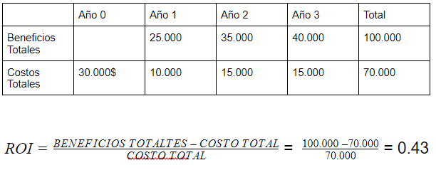

## Nombre del Proyecto:
## Pagina Base:[barkibu](https://barkibu.com)
### Idea: Consultas veterinarias profesionales online

## Integrantes:

- Dennys Michel
- Sergio Prudencio
- Eliana Vargas
- John Choque

---
## **Solicitud del sistema** 

**Necesidad de Negocios:**
- Mejorar y facilitar el acceso a la información en línea.
- Facilitar el contacto con diferentes Veterinarias y Profesionales del área.
- Ofrecer una herramienta de marketing a veterinarios para atraer nuevos clientes, promocionarse y un canal de comunicación con sus clientes. 
- Agilizar la respuesta a preguntas frecuentes sobre la salud de las mascotas en 24 hrs tiempo máximo de respuesta.
- Generar contenido útil para el cuidado de mascotas.
- Los veterinarios podrán dar consejos y no asi un diagnostico en casos de gravedad, para lo cual se sugiere por medio de la plataforma alguna clinica veterinaria.

**Requisitos comerciales:**
- Proporcionar acceso en línea al sistema de información en la Web.
- Capturar información del registro de los clientes y veterinarios.
- Producir informes del servicio que brindan los clientes a los usuarios.

**Valor de negocio:**
Queremos expandirnos más para ayudar a nuestros clientes con sus mascotas para que vivan felices y sanas el mayor tiempo posible.
Beneficios tangibles: 
- Aumento en la lista de clientes.
- Encontrar veterinarias muy acorde a tu necesidad.
Beneficios intangibles:
- Ganar reconocimiento a través de la página.
- Préstamo de servicio de calidad.

**Problemas o limitaciones especiales:**
- Limitar a nivel nacional. Para un comienzo el sistema esta disponible para los veterinarios y usuarios bolivianos
- No se aceptan pagos por el servicios en línea, por tanto el sistema tampoco realizara facturacion.
- Diagnósticos básicos previa a la consulta física, es decir

## **Analisis de Factibilidad** 

**Viabilidad Técnica**

- Las Veterinarias están disponibles para brindar ayuda en esta área. El tamaño del proyecto se considera de riesgo medio a bajo, ya que las limitaciones del proyecto se encuentran a nivel Nacional.
- Se requerirá la participación de los Veterinarios.
- Se requerirá un monto de pago por el tiempo de suscripción de cada Veterinario.

**Viabilidad Económica**

Se está usando el análisis de Rendimiento de la inversión, del cual se obtiene lo siguiente:

