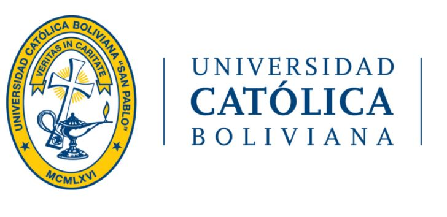

## Desarrolladores: 
### Grupo 3 FreeVet
## Cliente: 
### Grupo 1 Waliki
---
## Integrantes:

- Sergio Prudencio
- Eliana Vargas
- John Choque
- Dennys Michel
---
## **Introducción**

En el presente documento se puede observar las historias de Usuario para la plataforma de crowdfunding “Waliky”.
Una historia de usuario es una representación de los requisitos que se precisan para la elaboración de un sistema, es un lenguaje que permite a cualquier individuo entender con facilidad sin tener conocimiento previo en informática o programación. 
Es plataforma está dirigida a 2 tipos de público:
- Artesanos que deseen hacer emprendimientos.
- Donantes que quieran que algún emprendimiento salga a la luz y en algún caso recibir algún recompensa de los creadores del emprendimiento.

El objetivo del documento es identificar los requisitos del sistema y plasmar cada uno de ellos, para desarrollar de forma precisa la plataforma mencionada y explicar los procesos que se llevarán a cabo.

Durante el análisis de la idea planteada por “Waliky”, se determinaron 13 historias de usuario, cada una cuenta con una descripción de los procesos que se realizará, quién lo podrá realizar y también, se podrá visualizar un mockup de la pantalla del sistema. 
Esta plataforma contará con 3 tipos de usuarios: 
1. El primero es el Artesano, quien tendrá el papel de crear un perfil de emprendedor y podrá publicar en un foro sus propuestas de emprendimiento para recaudar fondos para los mismos.
2. El segundo es el Donante, quien tendrá como panel,crear un perfil de usuario, para poder hacer donaciones a los emprendimientos que le guste apoyar.
3. El tercero el Administrador, el nivel más alto de los usuarios que tendrá el papel de administrar las cuentas creadas y proporcionar la recuperaciones de contraseñas.

## **Objetivo**
Se identificará los requisitos y para así poder plasmarlos en el presente documento, para posteriormente desarrollar de forma precisa la plataforma requerida y explicar los procesos que esta llevará a  cabo.
## **A quién está dirigido**
Esta plataforma de crowdfunding está dirigida a los artesanos emprendedores que estén buscando recaudar fondos para realizar un emprendimiento, para lo cual ellos plantarán una idea de emprendimiento que será fomentada por donaciones de los usuarios “Donantes” de la plataforma crowfunding.
## **Niveles de prioridad**
Los niveles de prioridad serán en función al efecto que tenga en el núcleo del sistema, que en esta plataforma sería la publicación y transacción de los productos. Para este sistema se definen los siguientes niveles de prioridad: 

1. Alta: Este módulo afecta al núcleo del sistema directamente, por lo tanto es indispensable.
2. Medio: El módulo afecta al núcleo del sistema parcialmente. 
3. Bajo: Afecta al núcleo del sistema de forma externa, sin embargo es prescindible.

## **Historias de usuario**

| **Codigo** | 001 |
| ----------- | ----------- |
| **Nombre** | Registro de Usuario - Donante |
| **Prioridad del Negocio** | Alta/Escencial |
| **Descripcion** | Se registrara usuarios nuevos en la plataforma que permitirá tener acceso a paginas y subpáginas. |
| **Validacion** | Para que un nuevo usuario sea registrado en la plataforma debe ingresar un nombre completo, correo, teléfono, dirección y contraseña, es necesario leer el contrato digital y aceptar las condiciones del contrato. Los campos deben ser obligatorios y tener carácter valido. |

| **Codigo** | 001 |
| **Nombre** | Registro de Usuario - Donante |
| **Prioridad del Negocio** | Alta/Escencial |
| **Descripcion** | Se registrara usuarios nuevos en la plataforma que permitirá tener acceso a paginas y subpáginas. |
| **Validacion** | Para que un nuevo usuario sea registrado en la plataforma debe ingresar un nombre completo, correo, teléfono, dirección y contraseña, es necesario leer el contrato digital y aceptar las condiciones del contrato. Los campos deben ser obligatorios y tener carácter valido. |

## **Conclusión**
