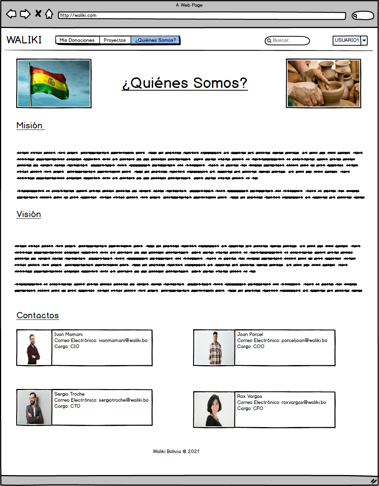
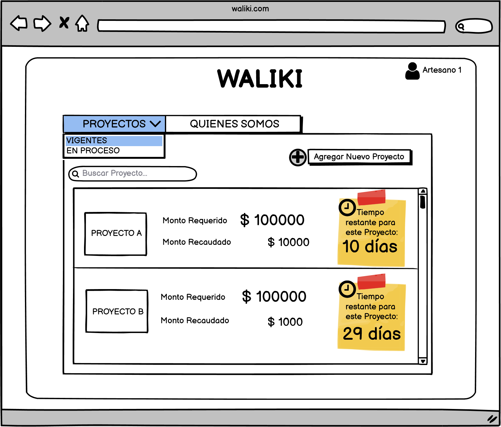
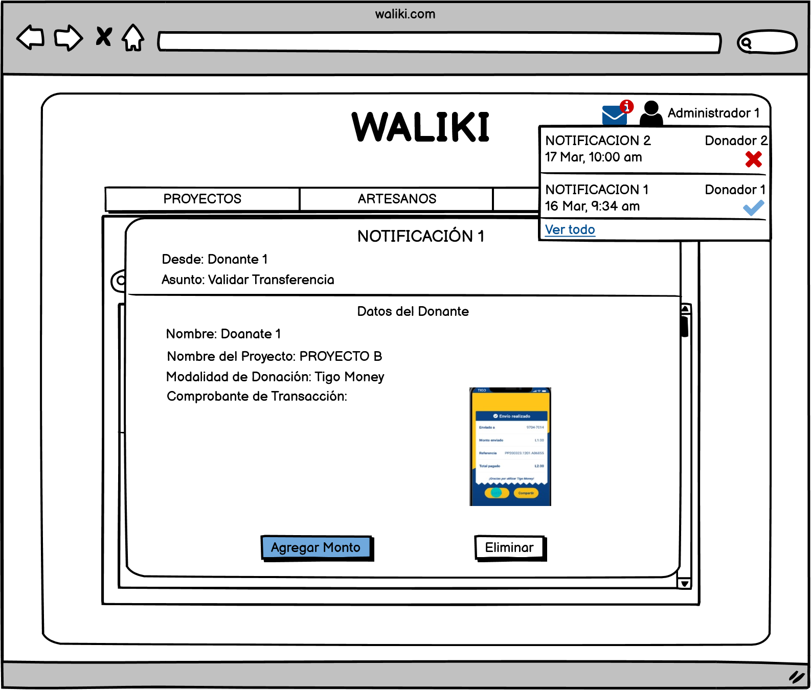
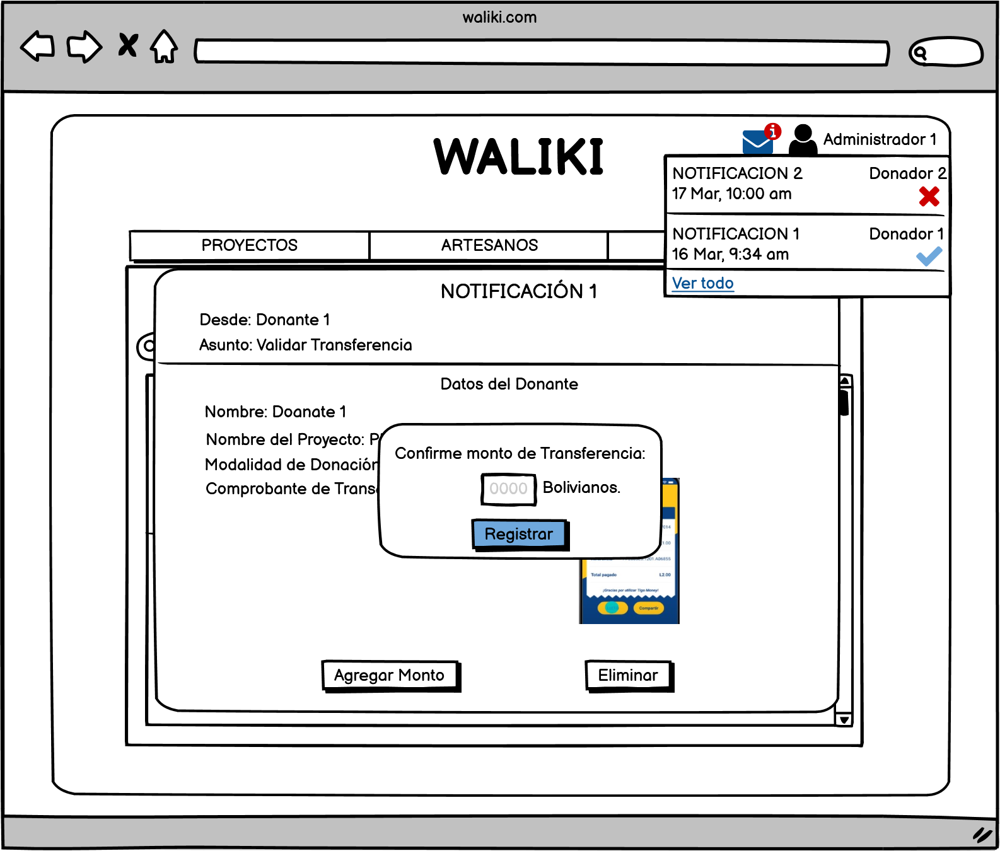

## Desarrolladores: 
### Grupo 3 FreeVet
## Cliente: 
### Grupo 1 Waliki
---
## Integrantes:

- Sergio Prudencio
- Eliana Vargas
- John Choque
- Dennys Michel
---
# **Índice de Historias de Usuario**
- Página principal
- Inicio de Sesión
- Registro del Artesano
- Registro de Donador
- Registro del Administrador
- Recuperar contraseña
- Registrar Proyecto
- Visualización del proyecto
- Visualización del perfil del artesano
- Visualización del perfil del donante
- Formulario de donaciones
- Registro de transferencia
---
# **Indice de Figuras**
- 

---
## **Introducción**

En el presente documento se puede observar las historias de Usuario para la plataforma de crowdfunding “Waliki”. Una historia de usuario es una representación de los requisitos que se precisan para la elaboración de un sistema, 
es un lenguaje que permite a cualquier individuo entender con facilidad sin tener conocimiento previo en informática o programación. Es plataforma está dirigida a 2 tipos de público:
- Artesanos que deseen hacer emprendimientos.
- Donantes que quieran que algún emprendimiento salga a la luz y en algún caso recibir algún recompensa de los creadores del emprendimiento.

El objetivo del documento es identificar los requisitos del sistema y plasmar cada uno de ellos, para desarrollar de forma precisa la plataforma mencionada y explicar los procesos que se llevarán a cabo.

Durante el análisis de la idea planteada por “Waliki”, se determinaron 13 historias de usuario, cada una cuenta con una descripción de los procesos que se realizará, quién lo podrá realizar y también, se podrá visualizar un mockup de la pantalla del sistema. 
Esta plataforma contará con 3 tipos de usuarios: 
1. El primero es el Artesano, quien tendrá el papel de crear un perfil de emprendedor y podrá publicar en un foro sus propuestas de emprendimiento para recaudar fondos para los mismos.
2. El segundo es el Donante, quien tendrá como panel,crear un perfil de usuario, para poder hacer donaciones a los emprendimientos que le guste apoyar.
3. El tercero el Administrador, el nivel más alto de los usuarios que tendrá el papel de administrar las cuentas creadas y proporcionar la recuperación  de contraseñas.

## **Objetivo**
Se identificará los requisitos y para así poder plasmarlos en el presente documento, para posteriormente desarrollar de forma precisa la plataforma requerida y explicar los procesos que esta llevará a cabo.
## **A quién está dirigido**
Esta plataforma de crowdfunding está dirigida a los artesanos emprendedores que estén buscando recaudar fondos para realizar un emprendimiento, para lo cual ellos plantarán una idea de emprendimiento que será fomentada por donaciones de los usuarios “Donantes” de la plataforma crowfunding.
## **Niveles de prioridad**
Los niveles de prioridad serán en función al efecto que tenga en el núcleo del sistema, que en esta plataforma sería la publicación y transacción de los productos. Para este sistema se definen los siguientes niveles de prioridad: 

1. Alta: Este módulo afecta al núcleo del sistema directamente por lo tanto, es indispensable.
2. Medio: El módulo afecta al núcleo del sistema parcialmente. 
3. Bajo: Afecta al núcleo del sistema de forma externa sin embargo, es prescindible.

## **Historias de usuario**

### **01 Pagina principal**
| **Codigo** |	RF-01 |
| ----------- | ----------- |
| **Nombre** | Pagina Principal  |
| **Prioridad del Negocio** |	Alta/Escencial |
| **Descripción** | Esta sera la pagina de inicio donde el usuario/cliente podra acceder a los diferentes modulos de la plataforma |
| **Validación** | Para esta Vista previa se mostrara una lista de menus donde el usuario podra ver el contenido de la pagina  |

### **Figura 1**

### **02 Login**
| **Codigo** |	RF-02 |
| ----------- | ----------- |
| **Nombre** | Login  |
| **Prioridad del Negocio** |	Alta/Escencial |
| **Descripción** | Al ingresar con una cuenta existente, el botòn de ingresar llevará al usuario a la página principal de la
plataforma |
| **Validación** | Para que un usuario nuevo se registre en la plataforma debe ingresar un nombre de
usuario, correo y crear una contraseña. Estos campos deben tener caracteres válidos y todos son
obligatorios. |

### **Figura 2**

### **03 Registro de Usuario - Donante**

| **Codigo** | RF-03 |
| ----------- | ----------- |
| **Nombre** | Registro de Usuario - Donante |
| **Prioridad del Negocio** | Alta/Escencial |
| **Descripción** | Se registrará usuarios nuevos en la plataforma que permitirá tener acceso a ver los proyectos publicados por los artesanos y realizar donaciones si así lo desea entre otras acciones que puede realizar. |
| **Validación** | Para que un nuevo usuario sea registrado en la plataforma debe ingresar un nombre usuario (Campo obligatorio), correo (Campo obligatorio), teléfono(Campo obligatorio), dirección (Campo obligatorio) y contraseña (Campo obligatorio), es necesario leer el contrato digital y aceptar las condiciones del contrato para poder ser registrado. |

### **Figura 3**

### **04 Registro de Usuario - Artesano**

| **Codigo** | RF-04 |
| ----------- | ----------- |
| **Nombre** | Registro de Usuario-Artesano  |
| **Prioridad del Negocio** | Alta/Escencial |
| **Descripción** | Se registrará usuarios nuevos en la plataforma que permitirá tener acceso para publicar sus proyectos y buscar financiamiento de algún donador. Al momento del registro de los datos del usuario- artesano automáticamente obtendrá una cuenta de banco creada online (La organización Waliki realizo un convenio con un banco para que cada artesano tenga una cuenta de banco para facilitar la transacción), también el usuario debe adjuntar una fotografía del carnet de identidad anverso y reverso para corroborar los datos llenados y alguna fotografía del trabajo que realiza. |
| **Validación** | Para que un nuevo usuario sea registrado en la plataforma debe ingresar un nombre completo (campo obligatorio),fecha de nacimiento (campo obligatorio),correo(campo obligatorio), C.I. (campo obligatorio),teléfono (campo obligatorio), dirección (campo obligatorio), cargar imagen (obligatorio), contraseña (obligatorio) y carga de fotografía(obligatorio). Los campos deben ser obligatorios y tener carácter valido. |

### **Figura 4**

### **05 Registro de Usuario - Administrador**

| **Codigo** | RF05 |
| ----------- | ----------- |
| **Nombre** | Registro de cuenta para administradores |
| **Prioridad del Negocio** | Alta/Escencial |
| **Descripción** | Se registrará usuarios nuevos en la plataforma que permitirá tener acceso total a páginas y subpáginas y tendrá el control absoluto del sitio web. |
| **Validación** | Para que un nuevo usuario sea registrado en la plataforma debe ingresar un nombre completo (campo obligatorio), correo (campo obligatorio), teléfono (campo obligatorio), ciudad (campo obligatorio), y contraseña (campo obligatorio). |

### **Figura 5**

### **6 Recuperación de contraseña**
| **Codigo** | RF-6 |
| ----------- | ----------- |
| **Nombre** | Recuperación de contraseña |
| **Prioridad del Negocio** | Mediano/Deseado |
| **Descripción** | La recuperación de contraseña es una funcionalidad que permite que el usuario pueda recuperar su contraseña en caso de olvidarla. El proceso de verificación comienza pidiendo el correo electrónico con el que se registro en la plataforma web, posteriormente el sistema mandará un código de verificación a dicho correo, después el usuario deberá ingresar el código proporcionado, el ultimo paso será proporcionar la nueva contraseña y mostrar un mensaje de cambio exitoso. |
| **Validación** | Pasos de la validación:
- Verificar que el correo electrónico proporcionado este registrado en la plataforma.
- Verificar que el Código que introdujo el Usuario coincide con el que se envió a su correo. electrónico.
- Verificar que la nueva contraseña no sea la misma que la anterior.
- Verificar que vuelva a escribir correctamente su nueva contraseña en los 2 campos de entrada. |

### **Figura 6** Verificación de correo electrónico.

### **Figura 6.1** Verificación del Código.

### **Figura 6.2** Verificación de la nueva contraseña.

### **Figura 6.3** Mensaje de cambio de contraseña exitoso.

### **07 Registro de proyectos**

| **Codigo** | RF-07 |
| ----------- | ----------- |
| **Nombre** | Registro de Proyectos |
| **Prioridad del Negocio** | Alta/Escencial |
| **Descripción** |En este formulario se utilizara para que los usuarios de tipo "Artesano" quiera registrar un nuevo proyecto. |
| **Validación** | Para que este registro se agregue se pedira los siguientes parametro:
- Nombre del proyecto.
- Monto de Recaudacion. 
- Descripcion detallada del proyecto.
- Agregar Imagenes. |

### **Figura 7**

### **8 Visualizacion del proyecto**

| **Codigo** | RF-8 |
| ----------- | ----------- |
| **Nombre** | Visualización del proyecto |
| **Prioridad del Negocio** | Mediano/Deseado |
| **Descripción** | En este apartado el artesano puede ver el estado de proyecto con todos los datos que lleno al registrar su proyecto. |
| **Validación** | El usuario puede observar los datos del proyecto como ser:
- Descripción.
- Fotos.
- Monto Requerido.
- Monto Recaudado (Hasta el momento). |

### **Figura 9** Visualización del proyecyo para el usuario.

### **Figura 9** Visualización del proyecto para el artesano.

### **Figura 9** Agregando nueva actualización.

### **10 Visualizar perfil de Usuario-Artesano**
| **Codigo** |	RF-10 |
| ----------- | ----------- |
| **Nombre** | Perfil de usuario-Artesano |
| **Prioridad del Negocio** |	Alta/Escencial |
| **Descripción** | Cada artesano registrado contará con un perfil único donde podrá visualizar solo sus proyectos publicados. |
| **Validación** | Para este perfil, el artesano podrá gestionar sus proyectos de manera fácil  a través de un catálogo, el podrá editarlos o agregar un nuevo proyecto. |

### **Diagrama 10**

### **Figura 10**

### **11 Visualizar perfil de Usuario-Donante**
| **Codigo** |	RF-11 |
| ----------- | ----------- |
| **Nombre** | Perfil de usuario-Donante |
| **Prioridad del Negocio** |	Alta/Escencial |
| **Descripción** | Cada donante registrado contará con un perfil personal donde podrá ver todos aquellos proyectos que hizo alguna donación y así poder hacer seguimiento del proyecto. |
| **Validación** | Para este perfil, el donante podrá gestionar todos los proyectos a cuál el atribuyo una donación, podrá hacer seguimiento del proyecto viendo actualizaciones en base de imágenes o videos que suba cada semana el artesano. Si el Donante ve que el proyecto va por buen camino siempre tendrá la opción de hacer una nueva donación. |

### **Diagrama 11**

### **Figura 11**

### **12 Formulario de Donaciónes**
| **Codigo** |	RF-12 |
| ----------- | ----------- |
| **Nombre** | Registro de Formulario de Donación  |
| **Prioridad del Negocio** |	Alta/Escencial |
| **Descripción** | Una vez que el Donante identifique el proyecto por el cual optará hacer una donación, deberá registrarse en un formulario, registrar el monto a donar y seleccionar el modo de transferencia. |
| **Validación** | Para que esta donación se lleve a cabo deberá registrar su nombre completo, sexo, correo electrónico, teléfono, ciudad, seleccionar el monto a donar (no menos de 10 Bs.) y el tipo de transferencia. Al seleccionar la modalidad de donación se desplegará una nueva ventana donde se podrá observar los números de cuenta y su descripción. |

### **Diagrama 12**

### **Figura 12**

### **13 Registro de Transferencia**
| **Codigo** |	RF-13 |
| ----------- | ----------- |
| **Nombre** | Registro de Transferencia  |
| **Prioridad del Negocio** |	Alta/Escencial |
| **Descripción** | Se pretende tener un registro de todas las donaciones realizadas, por lo cual cada donante podrá registrar su donación una vez que realice la transferencia.  |
| **Validación** | Para este registro el sistema automáticamente generara un numero de transferencia y los datos del donante. El donante podrá volver a confirmar su monto de transacción y agregar una imagen con el comprobante (foto o scrinshot), y al final se enviará ese registro a los administradores para que sea verificado o rechazado. |

### **Figura 13**

### **Figura 13.1**

### **Figura 13.2**

### **Diagrama 13**

### **Figura 14**

## **Conclusión**
Concluido el análisis minucioso de los requerimientos necesarios para la la plataforma de crowfunding "Waliki",
se cumplió con el objetivo del documento, logrando identificar los requisitos
indispensables para el funcionamiento idóneo de la plataforma. Los requisitos identificados son 13
Cada proceso fue detallado y descrito a lo largo del documento para que sea entendible para cualquier
individuo. No obstante, es necesario aclarar que hay algunos procesos y funciones que serán externos
en la primera versión del sistema.