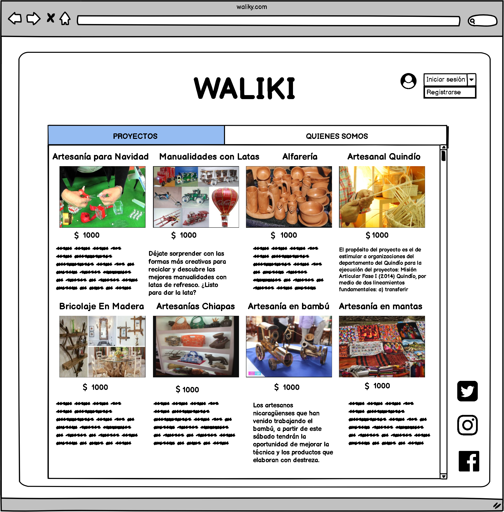
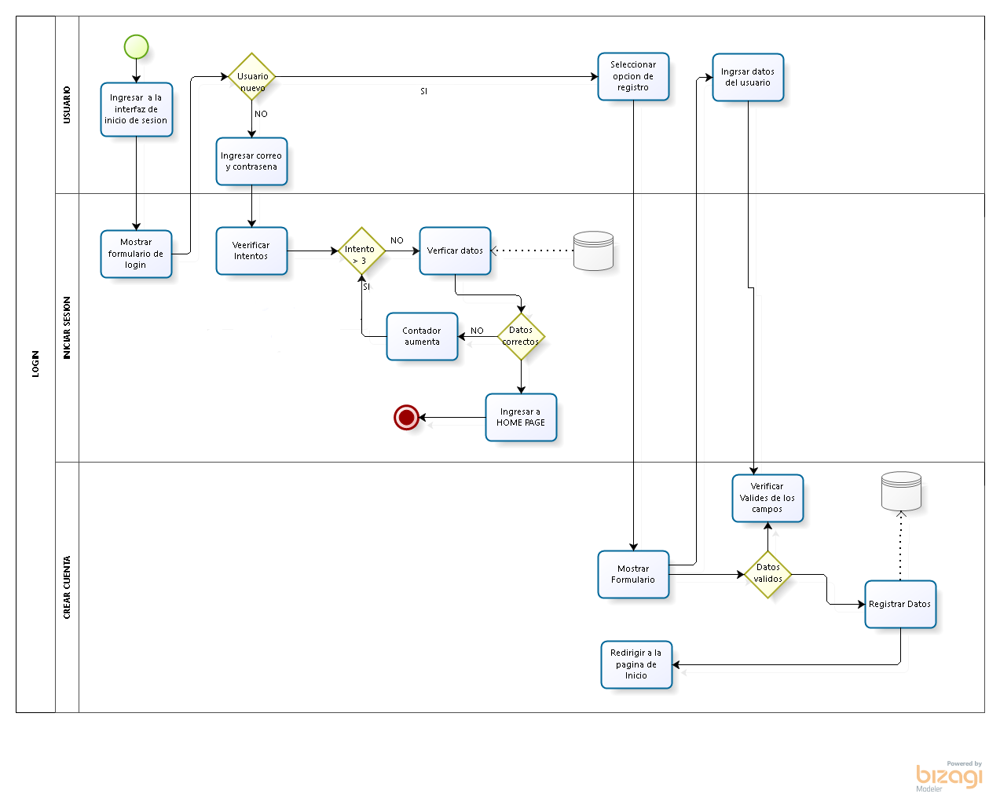
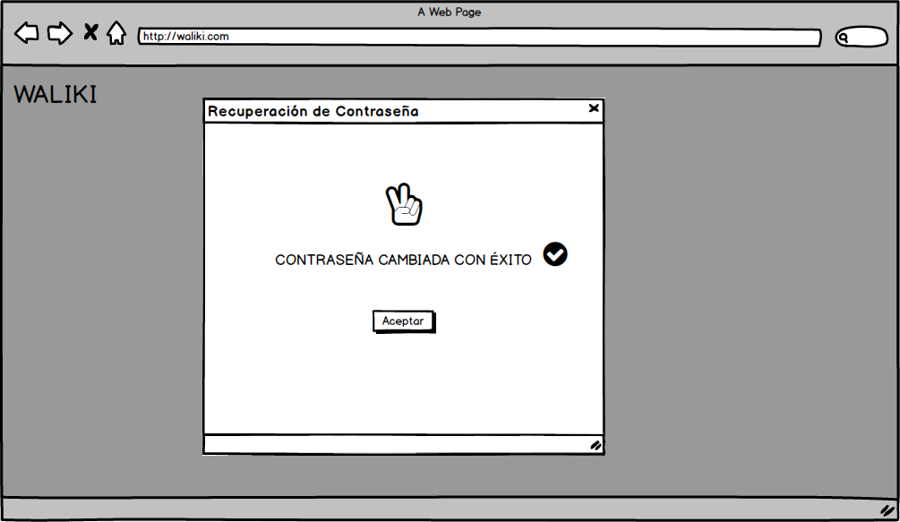
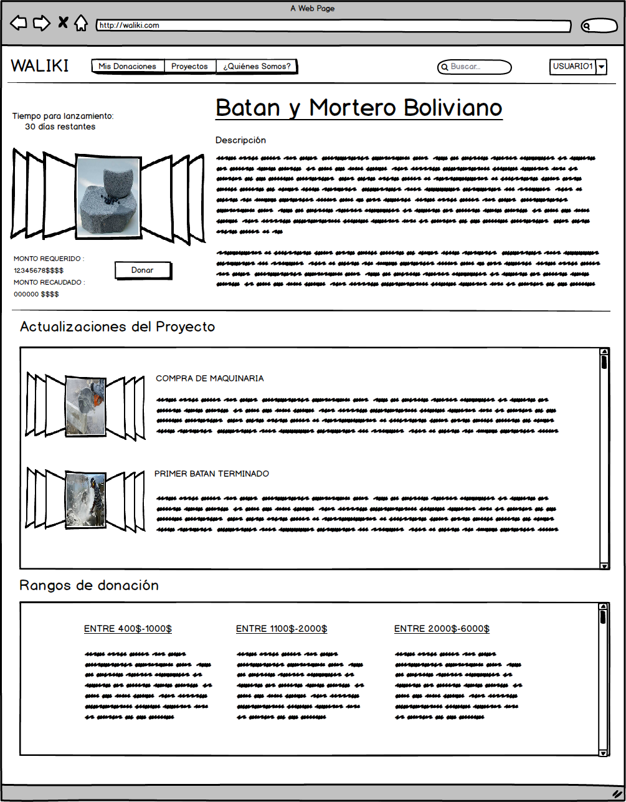

## Desarrolladores: 
### Grupo 3 FreeVet
## Cliente: 
### Grupo 1 Waliki
---
## Integrantes:

- Sergio Prudencio
- Eliana Vargas
- John Choque
- Dennys Michel
---
# **Índice de Historias de Usuario**
- Página principal
- Inicio de Sesión
- Registro del Artesano
- Registro de Donador
- Registro del Administrador
- Recuperar contraseña
- Registrar Proyecto
- Visualización del proyecto
- Visualización del perfil del artesano
- Visualización del perfil del donante
- Formulario de donaciones
- Registro de transferencia
---
# **Índice de Figuras**

- Figura 6 Verificación de correo electrónico.
- Figura 6.1 Verificación del Código.
- Figura 6.2 Verificación de la nueva contraseña.
- Figura 6.3 Mensaje de cambio de contraseña exitoso.
- Figura 8 Visualización del proyecyo para el usuario.
- Figura 8.1 Visualización del proyecto para el artesano.
- Figura 8.1 Nueva actualización de Proyecto.
---
# **Índice de Diagramas**
- Diagrama 1
- Diagrama 2
- Diagrama 3
- Diagrama 4
- Diagrama 5
---

## **Introducción**

En el presente documento se puede observar las historias de Usuario para la plataforma de crowdfunding “Waliki”. Una historia de usuario es una representación de los requisitos que se precisan para la elaboración de un sistema, 
es un lenguaje que permite a cualquier individuo entender con facilidad sin tener conocimiento previo en informática o programación. Es plataforma está dirigida a 2 tipos de público:
- Artesanos que deseen hacer emprendimientos.
- Donantes que quieran que algún emprendimiento salga a la luz y en algún caso recibir algún recompensa de los creadores del emprendimiento.

El objetivo del documento es identificar los requisitos del sistema y plasmar cada uno de ellos, para desarrollar de forma precisa la plataforma mencionada y explicar los procesos que se llevarán a cabo.

Durante el análisis de la idea planteada por “Waliki”, se determinaron 13 historias de usuario, cada una cuenta con una descripción de los procesos que se realizará, quién lo podrá realizar y también, se podrá visualizar un mockup de la pantalla del sistema. 
Esta plataforma contará con 3 tipos de usuarios: 
1. El primero es el Artesano, quien tendrá el papel de crear un perfil de emprendedor y podrá publicar en un foro sus propuestas de emprendimiento para recaudar fondos para los mismos.
2. El segundo es el Donante, quien tendrá como panel,crear un perfil de usuario, para poder hacer donaciones a los emprendimientos que le guste apoyar.
3. El tercero el Administrador, el nivel más alto de los usuarios que tendrá el papel de administrar las cuentas creadas y proporcionar la recuperación  de contraseñas.

## **Objetivo**
Se identificará los requisitos y para así poder plasmarlos en el presente documento, para posteriormente desarrollar de forma precisa la plataforma requerida y explicar los procesos que esta llevará a cabo.
## **A quién está dirigido**
Esta plataforma de crowdfunding está dirigida a los artesanos emprendedores que estén buscando recaudar fondos para realizar un emprendimiento, para lo cual ellos plantarán una idea de emprendimiento que será fomentada por donaciones de los usuarios “Donantes” de la plataforma crowfunding.
## **Niveles de prioridad**
Los niveles de prioridad serán en función al efecto que tenga en el núcleo del sistema, que en esta plataforma sería la publicación y transacción de los productos. Para este sistema se definen los siguientes niveles de prioridad: 

1. Alta: Este módulo afecta al núcleo del sistema directamente por lo tanto, es indispensable.
2. Medio: El módulo afecta al núcleo del sistema parcialmente. 
3. Bajo: Afecta al núcleo del sistema de forma externa sin embargo, es prescindible.

## **Historias de usuario**

### **1 Página principal**
| **Codigo** |	RF-1 |
| ----------- | ----------- |
| **Nombre** | Página Principal  |
| **Prioridad del Negocio** |	Alta/Esencial |
| **Descripción** | Esta sera la página de inicio donde el usuario/cliente podrá acceder a los diferentes módulos de la plataforma. |
| **Validación** | Para esta Vista previa se mostrara una lista de menús donde el usuario podrá ver el contenido de la página.  |

### **Figura 1** Vista de la página principal.

### **2 Login**
| **Codigo** |	RF-2 |
| ----------- | ----------- |
| **Nombre** | Login  |
| **Prioridad del Negocio** |	Alta/Esencial |
| **Descripción** | Al ingresar con una cuenta existente, el botón de ingresar llevará al usuario a la página principal de la plataforma. |
| **Validación** | Para que un usuario nuevo se registre en la plataforma debe ingresar un nombre de usuario, correo y crear una contraseña. Estos campos deben tener caracteres válidos y todos son obligatorios. |

### **Figura 2** Inicio de sesión

### **3 Registro de Usuario - Donante**

| **Codigo** | RF-3 |
| ----------- | ----------- |
| **Nombre** | Registro de Usuario - Donante |
| **Prioridad del Negocio** | Alta/Esencial |
| **Descripción** | Se registrará usuarios nuevos en la plataforma que permitirá tener acceso a ver los proyectos publicados por los artesanos y realizar donaciones si así lo desea entre otras acciones que puede realizar. |
| **Validación** | Para que un nuevo usuario sea registrado en la plataforma debe ingresar un nombre usuario (Campo obligatorio), correo (Campo obligatorio), teléfono(Campo obligatorio), dirección (Campo obligatorio) y contraseña (Campo obligatorio), es necesario leer el contrato digital y aceptar las condiciones del contrato para poder ser registrado. |

### **Figura 3** Registro Usuario- Donante

### **4 Registro de Usuario - Artesano**

| **Codigo** | RF-4 |
| ----------- | ----------- |
| **Nombre** | Registro de Usuario-Artesano  |
| **Prioridad del Negocio** | Alta/Esencial |
| **Descripción** | Se registrará usuarios nuevos en la plataforma que permitirá tener acceso para publicar sus proyectos y buscar financiamiento de algún donador. Al momento del registro de los datos del usuario- artesano automáticamente obtendrá una cuenta de banco creada online (La organización Waliki realizo un convenio con un banco para que cada artesano tenga una cuenta de banco para facilitar la transacción), también el usuario debe adjuntar una fotografía del carnet de identidad anverso y reverso para corroborar los datos llenados y alguna fotografía del trabajo que realiza. |
| **Validación** | Para que un nuevo usuario sea registrado en la plataforma debe ingresar un nombre completo (campo obligatorio),fecha de nacimiento (campo obligatorio),correo(campo obligatorio), C.I. (campo obligatorio),teléfono (campo obligatorio), dirección (campo obligatorio), cargar imagen (obligatorio), contraseña (obligatorio) y carga de fotografía(obligatorio). Los campos deben ser obligatorios y tener carácter valido. |

### **Figura 4** Registro Usuario Artesano.

### **5 Registro de Usuario Administrador**

| **Codigo** | RF-5 |
| ----------- | ----------- |
| **Nombre** | Registro de cuenta para administradores |
| **Prioridad del Negocio** | Alta/Esencial |
| **Descripción** | Se registrará usuarios nuevos en la plataforma que permitirá tener acceso total a páginas y subpáginas y tendrá el control absoluto del sitio web. |
| **Validación** | Para que un nuevo usuario sea registrado en la plataforma debe ingresar un nombre completo (campo obligatorio), correo (campo obligatorio), teléfono (campo obligatorio), ciudad (campo obligatorio), y contraseña (campo obligatorio). |

### **Figura 5** Registro de Usuario Administrador.

### **Diagrama 1** Creacion de cuenta.

### **6 Recuperación de contraseña**
| **Codigo** | RF-6 |
| ----------- | ----------- |
| **Nombre** | Recuperación de contraseña |
| **Prioridad del Negocio** | Mediano/Deseado |
| **Descripción** | La recuperación de contraseña es una funcionalidad que permite que el usuario pueda recuperar su contraseña en caso de olvidarla. El proceso de verificación comienza pidiendo el correo electrónico con el que se registro en la plataforma web, posteriormente el sistema mandará un código de verificación a dicho correo, después el usuario deberá ingresar el código proporcionado, el ultimo paso será proporcionar la nueva contraseña y mostrar un mensaje de cambio exitoso. |
| **Validación** | Pasos de la validación:- Verificar que el correo electrónico proporcionado este registrado en la plataforma.- Verificar que el Código que introdujo el Usuario coincide con el que se envió a su correo. electrónico.- Verificar que la nueva contraseña no sea la misma que la anterior.- Verificar que vuelva a escribir correctamente su nueva contraseña en los 2 campos de entrada. |

### **Figura 6** Verificación de correo electrónico.

### **Figura 6.1** Verificación del Código.

### **Figura 6.2** Verificación de la nueva contraseña.

### **Figura 6.3** Mensaje de cambio de contraseña exitoso.

### **7 Registro de proyectos**

| **Codigo** | RF-7 |
| ----------- | ----------- |
| **Nombre** | Registro de Proyectos |
| **Prioridad del Negocio** | Alta/Esencial |
| **Descripción** |En este formulario sera de utilidad para que los usuarios de tipo "Artesano" quieran registrar un nuevo proyecto.  |
| **Validación** |La plataforma muestra los espacios para registras los nuevos proyectos así mismo podrá subir imágenes y también un rango de incentivo "incentivo para el usuario que por sus donaciones"  así mismo podrá poner sus respectivos rangos y fecha de cada uno de ellos |

### **Figura 7** Registro de proyecto.

### **Figura 7.1** Creación rango de insentivos.

### **8 Visualizacion del proyecto**

| **Codigo** | RF-8 |
| ----------- | ----------- |
| **Nombre** | Visualización del proyecto |
| **Prioridad del Negocio** | Mediano/Deseado |
| **Descripción** | En este apartado se mostrará la vista del proyecto desde la perspectiva del donante y la del artesano. Para el caso del artesano se contará con un botón extra que permitirá subir nuevas actualizaciones respecto a su proyecto. Las actualizaciones al igual que los atributos del registro de proyecto no serán editables por motivos de seguridad y confiabilidad de cada proyecto. Para la vista del artesano se incluirá un botón que le permita subir actualizaciones. |
| **Validación** | En sección de la pagina esta divida en 3 partes que la constituyen: La sección de información general donde se muestran los detalles del proyecto como ser: Nombre del Proyecto, Tiempo para el lanzamiento, Descripción, Fotos o Video del proyecto, Monto requerido y recaudado. En siguiente sección se observa las actualizaciones que publica el Artesano, ordenadas por fecha de publicación.  En la última sección se observa los rangos de donación, donde el donante podrá conocer los rangos de las donaciones que posea cada proyecto. En caso de que el Artesano no cuente con incentivos por rangos de donaciones simplemente se mostrar un mensaje que indique que este proyecto no cuenta con rangos de donación. |

### **Figura 8** Visualización del proyecyo para el usuario.

### **Figura 8.1** Visualización del proyecto para el artesano.

### **Figura 8.2** Agregando nueva actualización.

### **9 Visualizar perfil de Usuario-Artesano**
| **Codigo** |	RF-9 |
| ----------- | ----------- |
| **Nombre** | Perfil de usuario-Artesano |
| **Prioridad del Negocio** |	Alta/Esencial |
| **Descripción** | El perfil del “Artesano” permitirá gestionar todos los proyectos que éste mismo publique, tanto así, como de agregar nuevos proyectos. Una vez que inicie su sesión como Artesano, podrá ver en una lista sus proyectos que aún están vigentes (que aún no entran en etapa de ejecución) y están en proceso de recaudación de dinero. También podrán visualizar en otra pestaña todos sus proyectos que ya terminaron su etapa de recaudación y están en proceso de elaboración. |
| **Validación** | Para esta validación se deberá ingresar como usuario “Artesano”, en la opción de proyectos vigentes se podrá ver. El tiempo restante del proyecto, el monto requerido para la ejecución del proyecto y el monto recaudado hasta la fecha. También tendrá la opción de agregar un nuevo proyecto, que lo redireccionará a un formulario de registros de proyectos. Los proyectos en proceso permitirán, visualizar el monto final recaudado, con el que el artesano empezó la elaboración del proyecto. Aquí podrá agregar actualizaciones por proyecto (recomendable que sea semanalmente), para que los donares puedan hacer seguimiento al proyecto que decidieron apoyar con una donación. |

### **figura 9** Perfil de Artesano - Proyectos Vigentes.

### **Figura 9.1** Perfil de Artesano - Proyectos en Proceso.

### **10 Perfil de usuario-Donante**

| **Codigo** |	RF-10 |
| ----------- | ----------- |
| **Nombre** | Perfil de usuario-Donante |
| **Prioridad del Negocio** |	Alta/Esencial |
| **Descripción** |El perfil del “Donador” permitirá visualizar todos los proyectos que se publiquen en la página y aquellos proyectos que recibieron cualquier monto de donación por el mismo Usuario- Donador. Una vez que inicie su sesión como Donador, podrá ver en una lista todos los proyectos que aún están vigentes (que aún no entran en etapa de ejecución) y están en proceso de recaudación de dinero, aquí el donador tendrá la opción de realizar donaciones. También podrán visualizar en otra pestaña todos aquellos proyectos que ya están en etapa de elaboración o en proceso de ejecución, donde el hizo una donación y así hacer un seguimiento al desarrollo del proyecto. |
| **Validación** | Para esta validación se deberá ingresar como usuario “Donador”, en la opción de proyectos vigentes se podrá visualizar: El tiempo restante de los proyectos (se priorizará los que estén próximos a expirar), el monto requerido para la ejecución del proyecto y el botón de “Donar”, donde te redireccionará a un formulario de donaciones. Se contará con un buscador inteligente, donde podrás buscar proyectos próximos a vencer, por departamentos, por tipo de artesanía, por nombres de proyectos y nombres de artesanos. La pestaña de proyectos en proceso permitirá visualizar a través de una lista, todos los proyectos al cual el donante realizo una transacción o donación. Se podrá ver el nombre del proyecto, nombre del artesano, fecha de inicio del proyecto y la fecha de conclusión. Aquí se podrá hacer un seguimiento sobre su proceso de elaboración, viendo las últimas actualizaciones que subieron los artesanos por cada proyecto. |

### **Figura 10** Perfil de Donante - Proyectos Vigentes.

### **Figura 10.1** Perfil de Donante - Proyectos en Proceso.

### **11 Formulario de Donaciónes**
| **Codigo** |	RF-11 |
| ----------- | ----------- |
| **Nombre** |Formulario de Donación  |
| **Prioridad del Negocio** |	Alta/Esencial |
| **Descripción** | Una vez que se identifique que proyecto apoyar, podrás realizar una donación a la vez, para esto aras clic en el botón “Donar” y se abrirá un formulario que identificara el nombre del donante y el nombre del proyecto. Podrás seleccionar una de las dos opciones para que puedas realizar la transferencia externamente. Una vez realizada la transferencia, tendrás que validarla, eligiendo esa opción, donde se habilitará un nuevo formulario que te permitirá agregar o subir en modo imagen el comprobante de la transferencia. Para finalizar, se deberá enviar todo ese proceso, para que, en un periodo de 24 horas, los administradores puedan verificar la transacción y registrarla como donación exitosa.|
| **Validación** | Para este proceso, se deberá elegir un proyecto en la sección de proyectos vigentes, la opción “Donar” te permitirá accederá un formulario que contendrá tus datos y únicamente deveras elegir una opción de donación. Para que tu transferencia sea registrada, se deberá subir una foto o scrinshot de la transacción bancaria o transferencia, este se enviara solo a los administradores para su respectiva verificación. |

### **Figura 11** Formulario de Donación.

### **Figura 11.1** Agregar Comprobante.

### **12 Notificaciones**
| **Codigo** |	RF-12 |
| ----------- | ----------- |
| **Nombre** | Notificaciones  |
| **Prioridad del Negocio** |	Alta/Esencial |
| **Descripción** | Por cada validación de transferencia enviada, se notificará a través de un mensaje a una cuenta de los administradores.Esta notificación permitirá ver solo datos esenciales (nombre proyecto, nombre donante, modalidad de donación y comprobante de transferencia) para que ayude a verificar que realmente se hizo la transacción y proceder al registro de la donación.|
| **Validación** | Para este proceso, los donadores deberán enviar la validación de transferencia, subiendo una imagen que compruebe que efectivamente se realizó la transacción. Los administradores contarán con la opción de notificaciones, ahí recibirán todas las validaciones de transferencias enviadas por los donadores. Cada notificación deberá agregar el monto de donación previamente comprobado, para que posteriormente sea registrada directamente en la base de Datos y ser visualizada en el perfil de los administradores.|

### **Figura 12** Notificación - Administrador.

### **Figura 12.1** Registrar Donación.

### **13 Visualizar perfil de Usuario-Administrador**

| **Codigo** |	RF-13 |
| ----------- | ----------- |
| **Nombre** | Visualización perfil de usuario-administrador |
| **Prioridad del Negocio** |	Alta/Esencial |
| **Descripción** | El usuario administrador podrá verificar todos los proyectos publicados por los artesanos registrados, los proyectos se visualizarán en orden descendente mostrando el último proyecto publicado al inicio, también podrá realizar búsquedas de los proyectos por intervalos de tiempo. Cada proyecto mostrara toda la información del proyecto como ser: Fecha de publicación, nombre del artesano, tiempo de publicación, tiempo restante de la publicación al momento, monto requerido, monto recaudado y descripción del proyecto. En la pestaña Artesanos el usuario administrador podrá verificar los datos con los que se registró el artesano y el número de proyectos que publico. Se podrá verificar en la pestaña de Donadores la información necesaria sobre cada donador nombre, correo fecha de donación, monto de donación por proyecto. Se podrá realizar la búsqueda por nombre del donador o proyecto mostrando una pantalla con el total donado. |
| **Validación** | Para este perfil el administrador tendrá toda la información que se publique sobre proyectos, registro de artesanos y cuantos proyectos tiene publicados y también podrá obtener información sobre donaciones realizadas a cada proyecto. |

### **Figura 13 - Proyectos publicados**

### **Figura 13.1 - Artesanos registrados**

### **Figura 13.2 - Listado de donadores**

### **Figura 13.3 - Verificacion de donaciones realizadas**

### **Diagrama** Registro Usuario Administrador.

### **15 ¿Quiénes somos?**
| **Codigo** |	RF-15 |
| ----------- | ----------- |
| **Nombre** | ¿Quiénes somos?   |
| **Prioridad del Negocio** | Bajo |
| **Descripción** | Este apartado esta dedicado a mostrar la información de la plataforma y a que está orientada la misma. Contemplara la misión, visión y los contactos de los encargados de la plataforma.  |
| **Validación** | Ninguna solo es informativa. |

## **Conclusión**
Concluido el análisis minucioso de los requerimientos necesarios para la la plataforma de crowfunding "Waliki",
se cumplió con el objetivo del documento, logrando identificar los requisitos
indispensables para el funcionamiento idóneo de la plataforma. Los requisitos identificados son 13
Cada proceso fue detallado y descrito a lo largo del documento para que sea entendible para cualquier
individuo. No obstante, es necesario aclarar que hay algunos procesos y funciones que serán externos
en la primera versión del sistema.